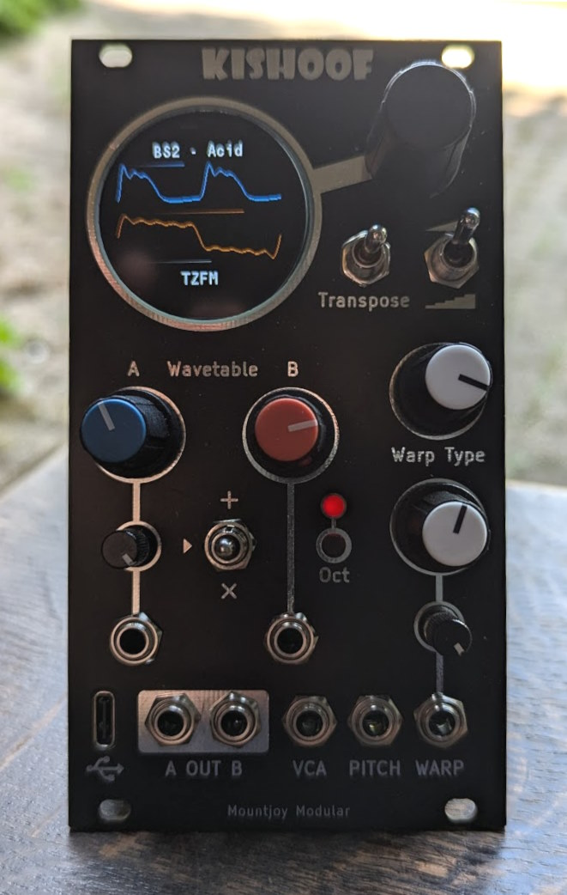
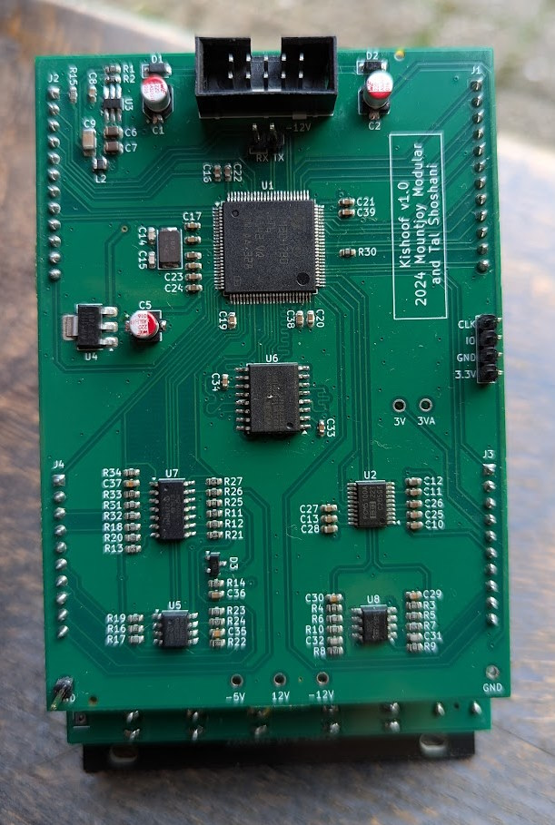
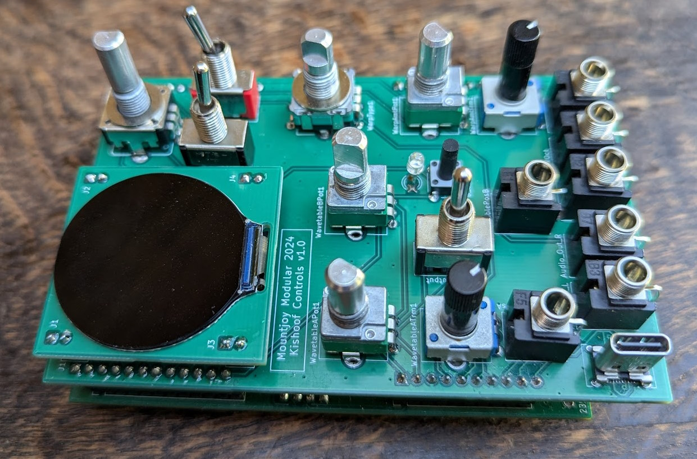

# Kishoof

## Overview

Kishoof is a Wavetable synthesizer designed for use in a Eurorack modular system. A dual channel architecture allows simultaneous playback of two channels each offering a different range of capabilities. Wavetables are held in 64MB of internal flash storage which is exposed as a USB disk drive via a front-panel USB C connector.

Two modes of operation are available with one stepping between individual wavetable frames and one smoothly interpolating between frames. In stepped mode channel A and B can each play any of the available wavetable frames. In smooth mode Channel A plays the loaded wavetable and channel B plays an internal wavetable that can be configured to hold a range of standard waveforms and harmonics.

A warp engine allows a range of warping effects to alter channel A's signal, with Bend, Squeeze, Mirror and though-Zero Frequency Modulation from channel B available. Channel B can be modulated via addition (mixing) and multiplication (ring modulation) with channel A and its playback direction can be reversed. Dynamic anti-aliasing filters eliminate aliasing regardless of modulation settings. 

A circular TFT LCD display shows both or either channel's waveform with any warping and modulation applied. A serial console available over a USB virtual COM port allows advanced configuration, calibration and trouble-shooting facilities.

The module was designed in conjunction with musician Tal Shoshani.

[Manual](Kishoof_Manual.md)

## Technical

Kishoof is based on an STM32H7B0 microcontroller clocked at 280MHz. Internal flash storage uses a Macronix MX25LM51245G 512Mbit NOR flash IC, clocked at 76.8MHz. The flash is controlled by the MCU using OctoSPI.

A TI PCM5100APW audio DAC is used for wavetable playback, operating in stereo at 48KHz. This is interfaced to the MCU over I2S. The MCU's internal 12 bit ADCs receive potentiometer and scaled Control voltage inputs.

The display is a circular 1.28 inch 240x240 IPS TFT LCD with GC9A01 Driver and is controlled via SPI. USB is connected via a front-panel USB C connector with ESD Protection.

**Construction**

The module is constructed of four PCBs: Component board, Control board, LCD daughterboard and Front Panel. The Component board is a 4-layer board. All others are 2 layer.

Circuit Design and layout using Kicad v8:

[Components schematic](Hardware/Kishoof_Components.pdf)

[Controls schematic](Hardware/Kishoof_Controls.pdf)

**Firmware**

Firmware written in C++20 using STM32CubeIDE version 1.15.1 and is available [here](Kishoof)

## Power

Digital power is supplied through a TI TPS561201 3.3V switching power supply and analog power via a 3.3V linear regulator.

- +12V current draw: 149 mA
- -12V Current draw: 7 mA

## Hardware Errata and Potential fixes

- VCA input should be normalised to a ~7V signal (currently bodged to 3.3V).
- Improve ground return paths on LCD daughterboard
- Invert LCD daughterboard to make orientation easier, and move pads towards cutout
